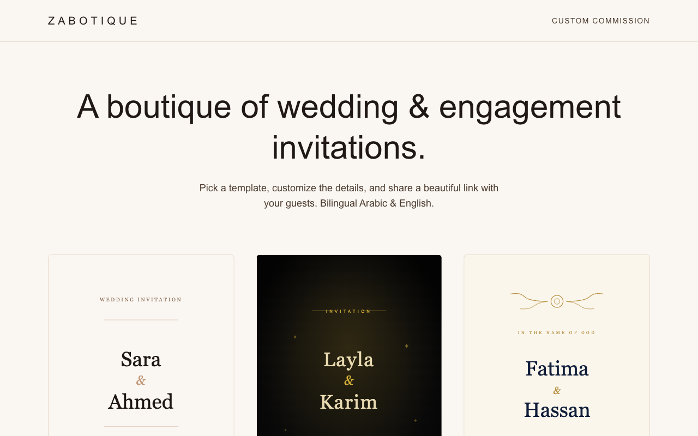

# Ziad Ahmed

### AI Engineer — I build & ship LLM products: RAG, agents, and fine-tuning

---

I turn AI and LLM ideas into products that actually ship. I help founders and teams build **retrieval-augmented (RAG) systems, autonomous agents, and custom LLM applications** — from prototype to production. Comfortable across the stack: Python/Go on the backend, Next.js on the front, and the modern LLM tooling in between.

**Open to freelance work** → [Upwork](https://www.upwork.com/freelancers/~01ed61069bdf946adc) · [ziadabdelsalam143@gmail.com](mailto:ziadabdelsalam143@gmail.com)

---

## 🚀 Featured Work

### [Zabotique](https://zabotique.vercel.app) &nbsp;·&nbsp; 🟢 Live

A boutique of digital wedding & engagement invitations — pick a template, customize the details, pay once, and share a hosted link with your guests. Bilingual Arabic + English.

**Stack:** Next.js 16 · Supabase (Postgres, Auth, Storage) · Lemon Squeezy · Resend · Vercel

**[→ Open the live site](https://zabotique.vercel.app)**

 

### More projects

| Project | What it does | Stack | Status |
|---|---|---|---|
| **Gaudia** | AI-generated animated event invitations — chat your invitation into existence, then send a permanent link guests can open | Next.js 16 · Vercel AI SDK · Claude | 🔵 In active development · *code private, walkthrough on request* |
| **Mentra** | Multi-tenant AI agent platform — registers any HTTP API and exposes it as a tool to a Claude-powered chat agent | FastAPI · Go · PostgreSQL | 🔵 In active development · *code private, walkthrough on request* |
| **Agentic RAG** | Infrastructure-agnostic agentic RAG platform — swap vector stores and models without rewrites | Python · vector DBs · LLM agents | 🔵 R&D · *code private, walkthrough on request* |
| [**txt-sql-langchain-agent**](https://github.com/Ziadabdelsalam/txt-sql-langchain-agent) | Plain-English → read-only PostgreSQL analytics via a LangChain agent | LangChain · FastAPI · Streamlit · LangSmith | 🟢 Public |
| [**deal-brief**](https://github.com/Ziadabdelsalam/deal-brief) | LLM-powered deal-text extraction pipeline with a React UI | Python · LLM · React | 🟢 Public |
| [**Dahab-chatbot**](https://github.com/Ziadabdelsalam/Dahab-chatbot) | Chatbot backed by an LLM fine-tuned on domain data (Reddit) | Python · fine-tuning | 🟢 Public |

> Private repos are client / product IP. Happy to walk through architecture and code live on a call.

---

## 🛠️ Tech Stack

**LLM / AI**

**Backend**

**Frontend**

**Data / Infra**

---

### 📬 Available for freelance AI work

